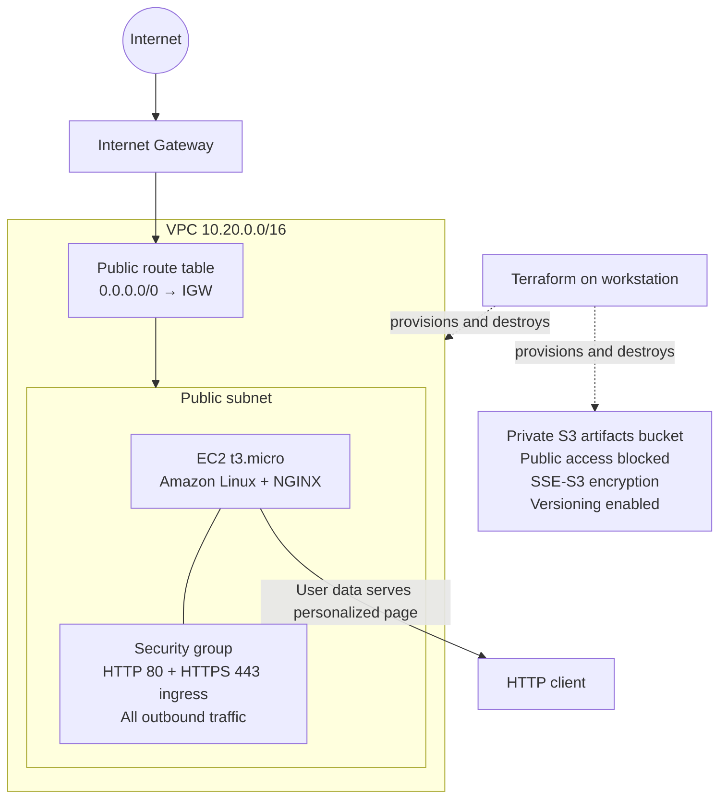

# Session 19 mini-project architecture

This diagram documents the Terraform lab topology. It is a source diagram,
not a screenshot of AWS Console.

```mermaid
flowchart TB
  internet((Internet)) --> igw[Internet Gateway]
  subgraph vpc[VPC 10.20.0.0/16]
    route[Public route table\n0.0.0.0/0 → IGW]
    subgraph subnet[Public subnet]
      ec2[EC2 t3.micro\nAmazon Linux + NGINX]
      sg[Security group\nHTTP 80 + HTTPS 443 ingress\nAll outbound traffic]
      ec2 --- sg
    end
    route --> subnet
  end
  igw --> route
  ec2 -->|User data serves personalized page| browser[HTTP client]
  tf[Terraform on workstation] -. provisions and destroys .-> vpc
  tf -. provisions and destroys .-> s3[Private S3 artifacts bucket\nPublic access blocked\nSSE-S3 encryption\nVersioning enabled]
```
